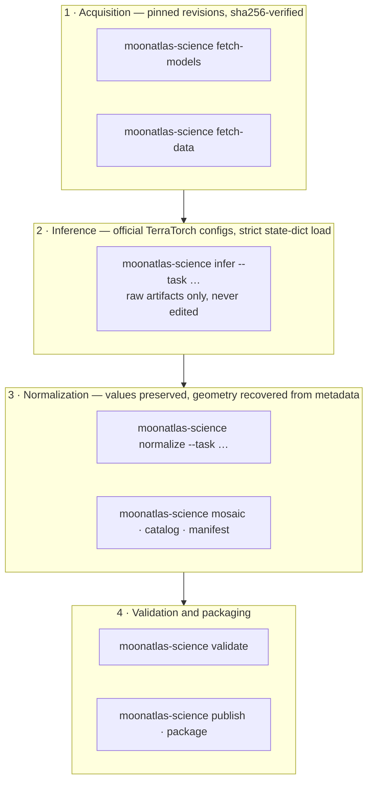

# MOONATLAS Science

**The open scientific and reproducibility layer behind MOONATLAS.**

MOONATLAS Science runs the published **NASA-IBM Lunar Foundation Model** task checkpoints over the **SomBench**
benchmark datasets, georeferences and normalizes their raw outputs, and validates the result into a versioned
lunar science dataset in which every value carries its provenance.

```
NASA / LRO lunar observations  (LROC WAC & NAC, LOLA, Diviner)
        ↓
NASA-IBM Lunar Foundation Model
        ↓
task checkpoints  (crater detection · polar ice prospectivity · IMP segmentation)
        ↓
MOONATLAS Science  ← this repository
        ↓
georeferenced, normalized, validated outputs  (science-<version>)
        ↓
applications — the interactive MOONATLAS application is one of them
```

MOONATLAS is an independent project. It is **not operated by, affiliated with, reviewed by or endorsed by NASA
or IBM**.

---

## At a glance

**What is MOONATLAS Science?**
An offline Python pipeline plus the data contract, validators, methodology and tests needed to check how
MOONATLAS turns published lunar AI models into scientific outputs.

**What can I do with this repository?**
Inspect how any published value is produced; validate a build; reproduce the smoke example or the full
inference from pinned upstream sources; reuse the normalized outputs in your own work; and propose improvements —
better geometry, validators, new legitimate lunar datasets or model tasks.

**What is not included?**
The interactive MOONATLAS application — its frontend, design system, branding and production deployment. It is a
separate product that consumes the outputs of this pipeline, the same way any other application could. Model
checkpoints and bulk upstream data are not included either: they are downloaded from their official sources.

**How do I run the smoke example?**
`pip install -e ".[dev]"`, then `moonatlas-science validate --root examples/science-smoke --scope published`.
No downloads needed. See [Quick start](#quick-start).

**How do I reproduce real inference?**
`python scripts/setup_environment.py`, then `moonatlas-science smoke` (one held-out sample per task, ~6.3 GB of
checkpoints). See [Reproducibility](#reproducibility).

**How do I contribute?**
Read [CONTRIBUTING.md](CONTRIBUTING.md), run the [development checks](#development), open a pull request.
Anything that changes a published value starts with an issue.

**What scientific claims must I not make?**
A detection is not a confirmed crater; an unmatched prediction is not a new crater; ice prospectivity is not a
probability or a measurement of ice; the IMP softmax score is uncalibrated and an IMP candidate is not an active
volcano; proximity is not coverage. The full list is in [Scientific integrity rules](#scientific-integrity-rules).

**Where does the data come from?**
The NASA-IBM Lunar Foundation Model and its three task checkpoints (Apache-2.0) and the SomBench datasets
(CC BY 4.0), which carry LROC imagery, LOLA and Diviner layers, and reference labels derived from Robbins (2019),
Coyan et al. (2025) and Hargitai et al. (2025). See [Citation](#citation) and [NOTICE](NOTICE).

## What is open, and what is a separate product

MOONATLAS is built in two parts on purpose. The science is open so that anyone can check it; the product is a
separate application built on top of it.

| Open — this repository | Separate product |
|------------------------|------------------|
| Science pipeline (inference orchestration, georeferencing, normalization, catalogue) | Interactive application |
| Reproducibility tooling (pinned acquisition, smoke test, deterministic packaging) | Frontend |
| Schemas and the data contract | Design system |
| Validation | Branding |
| Methodology and scientific documentation | Production deployment |
| Contribution infrastructure | |

The dependency runs one way: the application consumes a published output of this pipeline. Nothing here imports,
builds against or tests against the application, and a contribution merged here reaches the application only
through a new versioned science build.

---

## Contents

[Supported tasks](#supported-tasks) · [Architecture](#architecture) · [Install](#install) ·
[Quick start](#quick-start) · [Upstream assets](#acquiring-upstream-assets) · [Smoke test](#running-a-smoke-inference) ·
[Validation](#validation) · [Building outputs](#building-normalized-outputs) · [Tests](#running-tests) ·
[Development](#development) · [Reproducibility](#reproducibility) · [Provenance](#data-provenance) ·
[Raw → display → derived](#raw--normalized--display--derived) · [Coverage semantics](#coverage-semantics) ·
[Scientific integrity](#scientific-integrity-rules) · [Limitations](#known-limitations) ·
[Repository structure](#repository-structure) · [Contributing](#contributing) · [Citation](#citation) ·
[Licences](#licences-and-upstream-attribution) · [Independence](#independence)

## Supported tasks

| Task | Input | Model output kept | Normalized into |
|------|-------|-------------------|-----------------|
| **WAC crater detection** | LROC WAC tiles, 51.2 km at ~100 m/px | Predicted boxes with confidences (published at the deployment threshold 0.5) | Lunar coordinates and diameters through each tile's own projection; per-tile predicted and reference boxes |
| **Polar ice prospectivity** | 8 input layers, 256 × 256 at 240 m/px | Dense, unclipped regression array | Per-patch raw raster and statistics, plus one seamless mosaic per pole in the native polar stereographic grid |
| **IMP segmentation** | LROC NAC tiles, 256 m at ~1 m/px | Class logits → argmax mask | Mask raster, predicted area, tile share, mean class-1 softmax (uncalibrated), grouped repeat observations |

## Architecture



Each step runs in its own process and writes artifacts the next step reads, so a failure stops the chain instead
of substituting anything. Details: [docs/architecture/pipeline.md](docs/architecture/pipeline.md).

## Install

Python **3.11 or 3.12** (the upstream model package requires `>=3.11,<3.13`).

```bash
git clone https://github.com/RRG1312/moonatlas-science.git
cd moonatlas-science
python -m venv .venv
. .venv/bin/activate            # Windows: .venv\Scripts\activate
pip install -e ".[dev]"         # add ",reports" for the diagnostic figures
moonatlas-science env           # resolved paths and pinned upstream revisions
```

Inference additionally needs the upstream model package, installed at its pinned revision by
`python scripts/setup_environment.py`.

## Quick start

On a clean clone, with no downloads:

```bash
pytest                                                                     # fast suite
moonatlas-science validate --root examples/science-smoke --scope published # validate the example build
python -m moonatlas_science.contracts                                      # the data contract as JSON
```

`examples/science-smoke` is a small real build (three held-out samples, one per task);
`examples/conformance/geometry.json` holds expected geometry that any reimplementation can test against.

## Acquiring upstream assets

Nothing upstream is redistributed here. Everything is fetched from the official repositories at pinned
revisions, and checkpoints are verified against their published sha256. Downloads land in `data/`
(git-ignored); set `MOONATLAS_DATA_ROOT` to use a shared cache or another disk.

```bash
moonatlas-science fetch-models                       # backbone + 3 task checkpoints + task configs (~6.3 GB)
moonatlas-science fetch-data                         # SomBench splits, metadata and the smoke samples
moonatlas-science fetch-data --samples <sample-id> ...
```

A missing or mismatching asset is a hard failure: the pipeline never falls back to substitute data.

## Running a smoke inference

```bash
python scripts/setup_environment.py   # pinned upstream checkout + install + hardware check
moonatlas-science smoke               # add --skip-downloads once the assets are cached
```

One held-out test sample per task, end to end — download, inference, normalization, mosaic, catalogue, manifest,
validation, sanity report. The build lands in `data/build/science-0.3.0/`, figures in `data/artifacts/`, and each
step prints its own duration.

## Validation

```bash
moonatlas-science validate --root data/build/science-0.3.0            # a build you ran (full scope)
moonatlas-science validate --root examples/science-smoke --scope published
```

The validator is authoritative: ids and patterns, coordinate ranges, provenance against the pinned configuration,
splits, raw artifacts, geolocation (projection and grid reproduce every published centre and corner), raster
encodings, display rasters as clipped copies of raw values, mosaic placement, IMP mask counts, the discovery
registry and the processing manifest's checksums. `--scope published` skips only the cross-checks against local
raw inference artifacts, which exist only on the machine that ran the inference.

## Building normalized outputs

```bash
moonatlas-science infer     --task crater-detection --samples <id> ...
moonatlas-science normalize --task crater-detection
moonatlas-science mosaic                      # per-pole ice mosaics
moonatlas-science catalog                     # observation groups, discoveries, global stats
moonatlas-science manifest --scope full       # sources.json, manifest.json, processing-manifest.json
moonatlas-science validate
moonatlas-science publish                     # publish the validated build as a dataset
moonatlas-science package --out dist          # deterministic .tar.gz + sha256 manifest
```

`publish` and `package` copy, re-encode losslessly or check; they never recompute science.

## Running tests

| Suite | Command | Needs |
|-------|---------|-------|
| **Fast (CI)** | `pytest` | Nothing beyond the clone |
| **Upstream** | `pytest -m upstream` | Downloaded checkpoints and/or SomBench samples |

The fast suite covers geometry, projections (against `pyproj`), normalization helpers, the data contract, the
discovery registry, deterministic packaging, conformance fixtures and the scientific-integrity rules.

## Development

The same checks CI runs, locally:

```bash
ruff check .
pytest
moonatlas-science validate --root examples/science-smoke --scope published
python -m moonatlas_science.contracts > schemas/contract-v2.json && git diff --exit-code schemas/
```

If you change geometry or the example build, regenerate the conformance fixtures with
`python scripts/build_conformance.py` and commit the result.

## Reproducibility

| Level | What it proves | Command | Needs |
|-------|----------------|---------|-------|
| **1 · Clone test** | Package, contract, examples and deterministic transformations are intact | `pytest` + `moonatlas-science validate --root examples/science-smoke --scope published` | The clone |
| **2 · Smoke inference** | Your environment reproduces published behaviour on one held-out sample per task | `moonatlas-science smoke` | ~6.3 GB of checkpoints plus a few samples; GPU recommended, CPU works |
| **3 · Full reproduction** | The supported outputs rebuild from pinned upstream sources | `fetch-data` → `infer`/`normalize` per task → `mosaic` → `catalog` → `manifest` → `validate` | Checkpoints plus the task datasets; GPU strongly recommended |

Determinism: ordering, numeric formatting and timestamps are fixed, `processing-manifest.json` records the sha256
of every published file, and `moonatlas-science package` builds a byte-reproducible archive. This repository does
not quote runtimes it has not measured on your hardware; `smoke` prints them.

## Data provenance

Every published model output carries `task`, `sourceDataset`, `sourceTile`, `datasetSplit`, `model`,
`checkpoint`, `modelRevision`, `referenceSource` and `processingVersion`, and every build carries `sources.json`
with each upstream source, its licence, citation, pinned revision and whether MOONATLAS modified it. `test` is the
held-out split; `train` and `validation` predictions are in-sample and never presented as independent evidence of
model performance.

## Raw → Normalized → Display → Derived

| Level | What it is | Rule |
|-------|------------|------|
| **Raw** | The model's own output (unclipped regression array, boxes with scores, argmax mask) | Never clipped, smoothed or rescaled |
| **Normalized** | The same values georeferenced and expressed in the data contract | Value-preserving; documented and tested |
| **Display** | Clipped, colour-mapped rasters and previews for viewing | Never read back as a measurement |
| **Derived** | MOONATLAS computations (IoU and RMSE against a reference, interest score, coverage) | Always labelled MOONATLAS-derived, with a versioned formula id |

## Coverage semantics

A model output covers a coordinate only when the coordinate lies inside that output's own footprint — a WAC or
NAC tile quadrilateral, a valid pixel of an ice patch. **Proximity is not coverage:** distances rank nearby data
and never make a place analyzed. *No coverage* means the catalogue holds no output there; it says nothing about
what exists on the Moon. See [docs/coverage/semantics.md](docs/coverage/semantics.md).

## Scientific integrity rules

Enforced in review, in the validator and — where a machine can check it — in `tests/test_integrity_rules.py`:

- A model detection is **not** a confirmed or unique crater; predictions are candidates.
- A prediction unmatched with the Robbins catalogue is **not** a new crater.
- Ice prospectivity is **not** a probability or a measurement of ice.
- The IMP mean softmax score is **uncalibrated**; an IMP candidate is **not** an active volcano.
- A reference annotation is **not** a model prediction, and never the other way round.
- Proximity is **not** coverage, and no coverage is **not** the absence of a feature.
- Train/validation predictions are **not** held-out evidence; they are in-sample.
- Raw is **not** display; a number never comes from a colour-mapped raster.
- A MOONATLAS-derived metric is **not** a NASA or IBM output, and MOONATLAS is **not** a NASA or IBM project.

## Known limitations

- Partial coverage: the current build analyzes 1,470,244 km² (3.88 % of the surface) for craters, polar patches
  within ~10° of the poles for ice, and 130 NAC tiles for IMP.
- Overlapping WAC tiles repeat the same physical craters — 53,842 of 80,454 detections have a likely repeat — so a
  detection count is not a crater count.
- The ice model emulates a knowledge-driven expert map and inherits its assumptions; raw values may leave 0–1.
- Reference catalogues have completeness limits, so agreement metrics are descriptive, not ground truth.
- The upstream model cards state their outputs are not validated for operational decisions; this is a research
  tool and makes no stronger claim. More in [docs/limitations/README.md](docs/limitations/README.md).

## Repository structure

```
moonatlas-science/
├── src/moonatlas_science/       # the package
│   ├── config.py                # pinned revisions, paths, task configuration
│   ├── hub.py official.py       # upstream acquisition and the official task path
│   ├── geo.py projection.py     # projections, projection recovery, footprints
│   ├── *_inference.py           # one per task, raw artifacts only
│   ├── *_normalize.py mosaic.py # raw → contract, per task, plus per-pole mosaics
│   ├── catalog.py registry.py scoring.py sources.py manifest.py   # catalogue and provenance
│   ├── validate.py sanity.py contracts.py                         # validation and the contract descriptor
│   ├── steps/                   # runnable pipeline steps (python -m moonatlas_science.steps.<step>)
│   └── reports/                 # diagnostics and batch reviews
├── scripts/                     # setup_environment.py, build_conformance.py
├── configs/                     # committed append-only discovery registry
├── schemas/                     # the data contract as data
├── examples/                    # science-smoke build (CC BY 4.0 derivatives) + conformance fixtures
├── tests/                       # fast suite
├── notebooks/                   # optional GPU runner
└── docs/                        # architecture, methodology, datasets, models, provenance,
                                 # coverage, reproducibility, limitations
```

## Contributing

Start with [CONTRIBUTING.md](CONTRIBUTING.md). Keep raw model output untouched, attach provenance, keep the build
deterministic, add a test that fails without your change, and say whether an upstream version or
`processingVersion` moves. New lunar datasets and model tasks are in scope — CONTRIBUTING explains what they
need. Security issues go through [SECURITY.md](SECURITY.md), conduct through
[CODE_OF_CONDUCT.md](CODE_OF_CONDUCT.md).

## Citation

Cite **both** the software and the science it runs.

**1 · MOONATLAS Science (this software)** — see [CITATION.cff](CITATION.cff). No DOI is claimed.

**2 · The upstream science.** Metadata below is taken from the upstream model and dataset cards at the pinned
revisions; where they give no venue or DOI, none is listed here.

| Work | Citation |
|------|----------|
| NASA-IBM Lunar Foundation Model | Fraccaro, P., Nyirjesy, G., Szwarcman, D., Patil, H., et al. (2026). *Multimodal-Multiresolution Foundation Model for Lunar Remote Sensing.* Venue and DOI not stated upstream. |
| SomBench | Patil, H., Nyirjesy, G., Slank, R. A., Gaur, V., et al. (2026). *SomBench: Benchmark Dataset for Advancing Machine Learning in Lunar Science.* https://huggingface.co/collections/nasa-ibm-ai4science/lunar-fm-ml-ready-benchmark-dataset-sombench |
| Crater reference labels | Robbins, S. J. (2019). *A New Global Database of Lunar Impact Craters >1–2 km: 1. Crater Locations and Sizes, Comparisons With Published Databases, and Global Analysis.* Journal of Geophysical Research: Planets, 124, 871–892. doi:10.1029/2018JE005592 |
| Ice prospectivity reference | Coyan, J. A., et al. (2025). *Prospectivity mapping for lunar polar water ice.* Venue and DOI not stated upstream. |
| IMP reference annotations | Hargitai, H., et al. (2025). *Clusters of irregular mare patches on the Moon.* Venue and DOI not stated upstream. |

The upstream model cards also ask users to cite TerraMind (Jakubik et al., 2025), TerraTorch (Gomes et al., 2025)
and FlexiViT (Beyer et al., 2023), and credit the data products: LROC imagery; LOLA and Diviner layers. Each build's
`sources.json` records the exact revisions it used. MOONATLAS claims no authorship of any of this work.

## Licences and upstream attribution

MOONATLAS-owned source code: **Apache License 2.0** ([LICENSE](LICENSE)). Upstream material keeps its own licence;
[NOTICE](NOTICE) has the full statement and [docs/provenance/redistribution.md](docs/provenance/redistribution.md)
maps every file in this repository to its origin and licence.

| Source | Licence | Here |
|--------|---------|------|
| NASA-IBM LFM backbone + task checkpoints | Apache-2.0 | Downloaded at pinned revisions, never committed |
| SomBench datasets (WAC / Ice / IMP) | CC BY 4.0 | Downloaded; only small derived samples are redistributed, with attribution and a modification notice |
| Robbins (2019), Coyan et al. (2025), Hargitai et al. (2025) | Reach MOONATLAS only through SomBench | Cited; the original catalogues are not redistributed |
| LROC / LOLA / Diviner products | Instrument-team data, used through SomBench | Credited; originals not redistributed |

**Trademark.** "MOONATLAS", its logo and visual identity are not licensed by the Apache-2.0 grant (section 6). You
may state that your work uses or is derived from MOONATLAS Science; you may not use the name or marks to brand a
derived product or imply endorsement.

## Independence

MOONATLAS is an independent project that uses publicly released scientific models and datasets. It is **not
affiliated with, operated by, reviewed by or endorsed by NASA or IBM**, and no NASA or IBM logos or insignia are
used.
